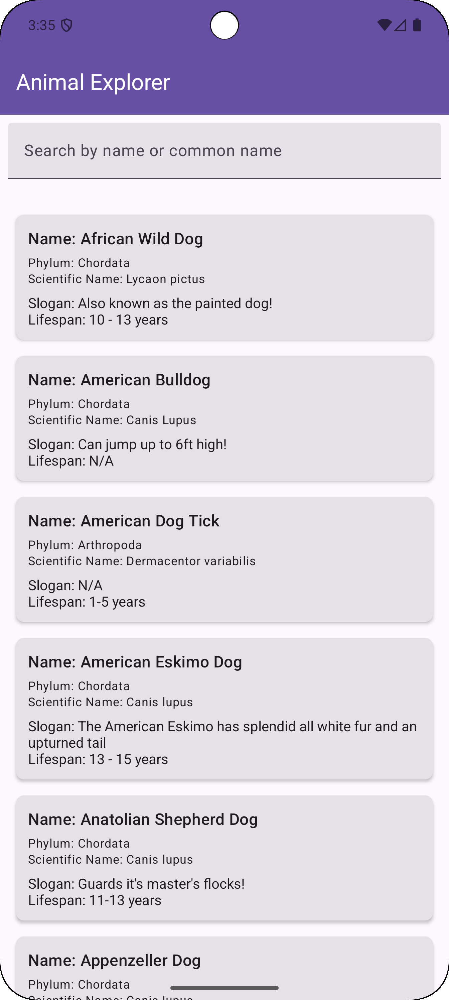
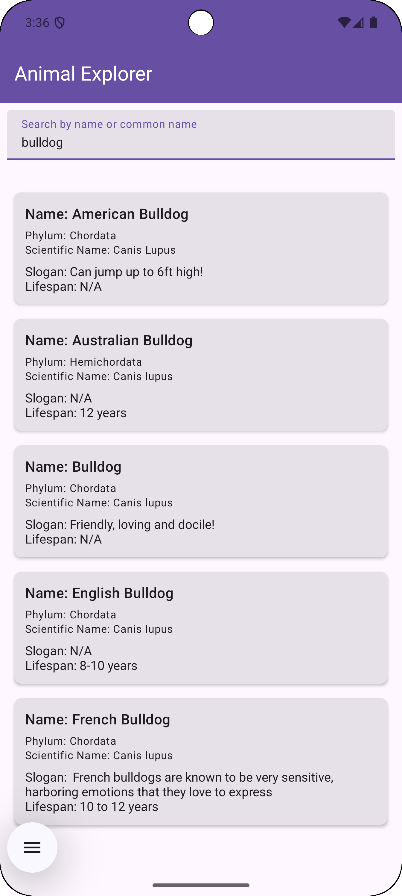
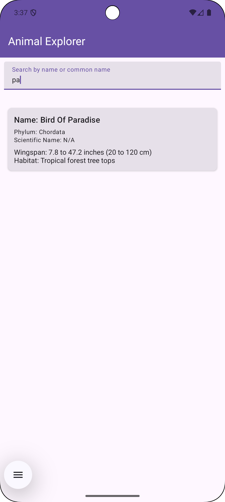
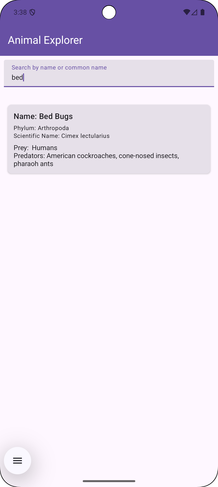
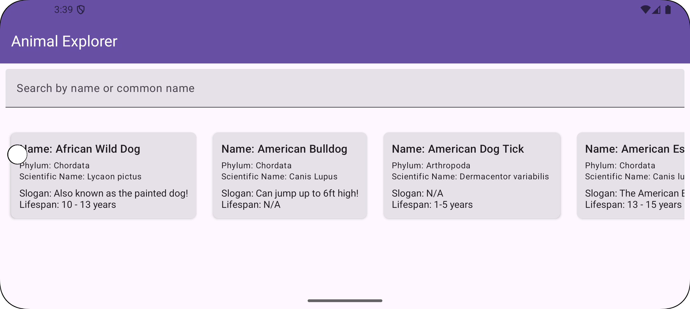

# Animal Explorer App

 A beautifully designed Android app built with Kotlin and Jetpack Compose. It uses the API Ninjas Animals API to fetch and display categorized animal data with support for filtering and caching. Users can explore Dogs, Birds, and Bugs, view unique attributes per animal type, and search across names.

## Screenshots

<p float="left">
  
  
   
   
   
</p>
 

## Features

- Fetches and displays categorized animal data (Dog, Bird, Bug)

- Caches API responses for 10 minutes

- Search/filter animals by name or common name

  Dynamic display with orientation-aware layout:

- Portrait: Vertical list

- Landscape: Horizontal scroll

  Rich data presentation:

- All animals: Name, Phylum, Scientific Name

- Dogs: Slogan, Lifespan

- Birds: Wingspan, Habitat

- Bugs: Prey, Predators

- Clear separation of concerns using MVVM with CLEAN Architecture


## 🛠️ Tech Stack

- **Language**: Kotlin
- **UI**: Jetpack Compose
- **Architecture**: MVVM + CLEAN
- **Dependency Injection**: Hilt
- **Networking**: Retrofit
- **Coroutines**: for async handling
- **State Management**: StateFlow and Compose `collectAsState`
- **Caching**: In-memory cache with 10-minute expiry
- **Orientation Handling**: Compose responsive UI


## API Reference

- [API Ninja docs](https://api-ninjas.com/api/animals)

Endpoints used:
- `GET /dog` – Fetch all dogs
- `GET /bird` – Get all birds data
- `GET /bug` – Get bugs data

## Testing

Basic UI and functional testing are performed using manual test cases to ensure:

- Animal data loads correctly for each category

- Cached data persists for 10 minutes before refreshing

- Search filter updates the list in real time

- Correct dynamic UI in both orientations

- Type-specific fields are shown conditionally

- Loading & error states are gracefully handled

## Project Structure

```plaintext
com.ghost.animalexplorer
│
├── data/
│   ├── model/               # Data classes for animals
│   ├── remote/              # Retrofit services and DTO mapping
│   └── repository/          # Implementation of animal data fetching and caching
│
├── domain/
│   ├── model/               # Domain-level models
│   ├── usecase/             # Business logic for fetching and filtering animals
│
├── presentation/
│   ├── components/          # Reusable composable UI elements
│   ├── screens/
│   │   └── list/            # AnimalListScreen with UI logic
│   ├── viewmodel/           # AnimalsViewModel with StateFlows
│
├── di/                      # Hilt modules
└── utils/                   # Utility classes and constants

